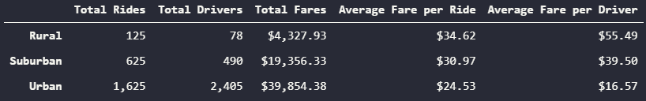
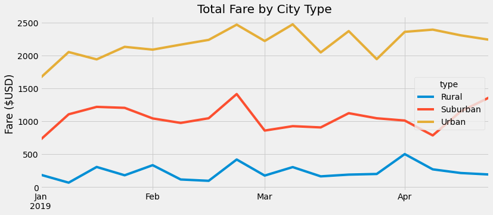

# PyBer_Analysis

## Overview

The purpose of this analysis is to compare PyBer ride sharing data for different types of cities over the course of the first four months of 2019.  This data can be used to inform business decisions.

## Results

As we can see from the summary data frame below, the more populous the area is, the higher the total fares, the number of drivers, and the number of rides are.  However, the average fare per ride and the average fare per driver are lower for the more populous areas.

This makes sense with supply and demand.  The higher the demand for rides, the more drivers there will be and each ride will cost less.  This results in a lower average fare per driver as the population density increases, rural being the lowest population density and urban being the highest population density.

The total fares by city type are shown in the graph below for the first four months of 2019.

As one would expect, the three trend lines have disparate values at all times throughout this four month period with the total fares peaking around the third week of February.

## Summary

The disparities among the city types regarding the total fares and average fare per driver are large. If we look at the summary data dataframe, we can see that the number of rides per driver is 1.6, 1.3, and 0.7 for rural, suburban, and urban areas respectively.  Coupled with the average fare per ride data, we can see that the drivers (and PyBer) could be making much more money from the urban areas if there were fewer drivers.  Unfortunately, this suggestion does involve layoffs.

